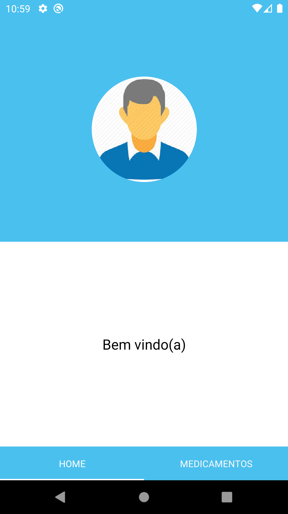
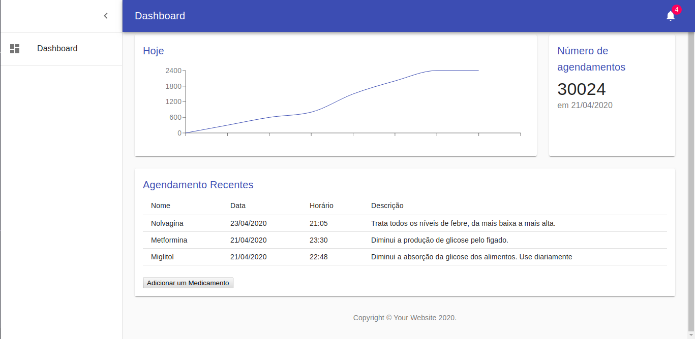
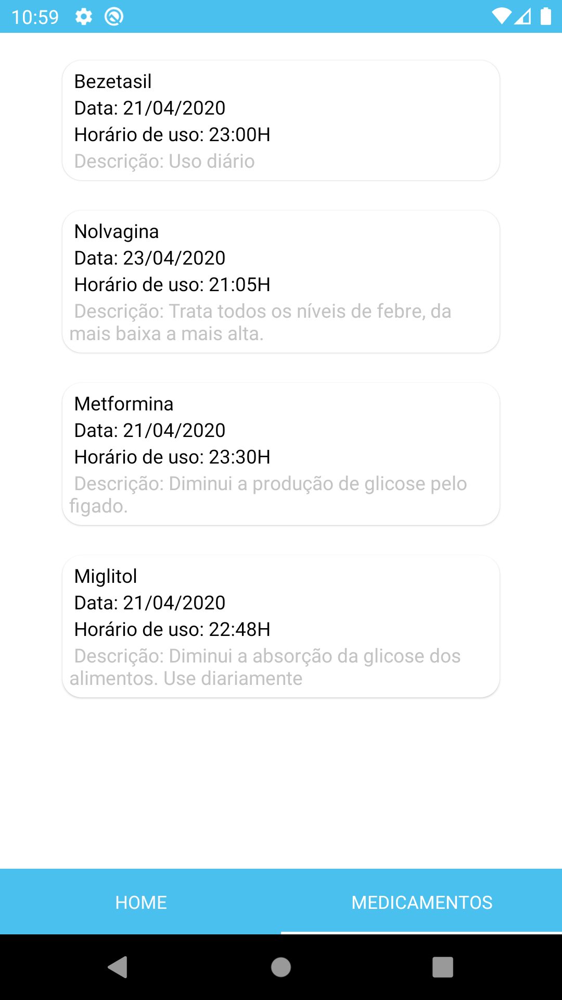
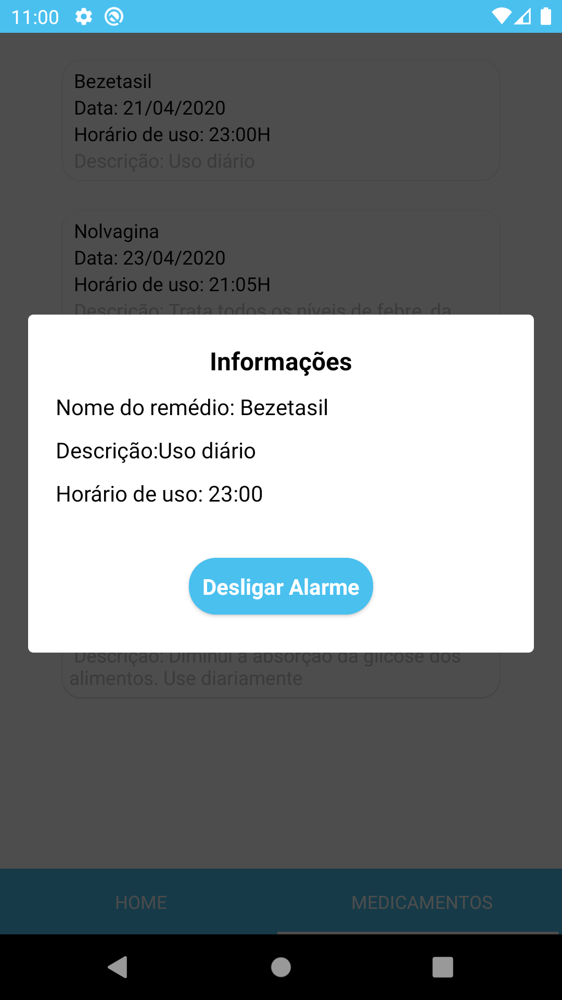

 MedReminder: ​​Application developed in NodeJs, React and React Native which aims to register medicines through a dashboard and then the mobile application trigger a notification when it is time to use the registered medicine .

 
 

  

 
 

  

 
 

  

  

## Features
- ⚛️ **React Js** — Lib JavaScript for build interfaces
    - Use of ⚛️ React Hooks.
    - Use ⚛️ MaterialUi to assist in the layout construction of dashboard.
    - Use of axios for communication with api.
    - Use of MomentJs for assist date formate.
    - Deploy for netfly.
- ⚛️ **React Native** —  Mobile framework that provides an efficient way to create native applications for Android and iOS.
    - Use of ⚛️ React Hooks.
    - Use of axios for communication with api.
    - Use of the styled-coponents library.
    - Use of the react-navigation library for navigation between screens.
    - Use of the react-native-modal; 
    - Use of the react-native-sound for set the alarm.
    - Use of the socket.io-client for listen to changes in real time.
- 💹 **Node Js** — Web framework  that allows server-side Javascript execution environment.
  -  Use Express a minimalist web framework for node.
  -  Use of mongoose, a driver to communicate with mongodb
  -  Use of dotenv, a module that loads environment variables
  -  Use of SocketIO, enables real-time, bidirectional and event-based communication.
  -  Deploy for heroku.

### BackEnd:
Run the lines below to launch the application in source backend

     - yarn install
     - yarn dev
     - running app in port 3333
### FrontEnd:

Run the lines below to launch the application in source front-end.

     - yarn install
     - yarn start
     - running app in port 3000.

### Mobile:
Run the lines below to launch the application on your physical device or emulator.

    - yarn install.
    - npx react-native start
    - npx react-native run-android
    - As soon as the process is finished, the application will run on the device that was installed.

    - (if there is an error in the terminal referring to the project libraries, correct by synchronizing the project in android studio).

## Licence

This project is licensed under the MIT License - See the [license](https://opensource.org/licenses/MIT) for details.